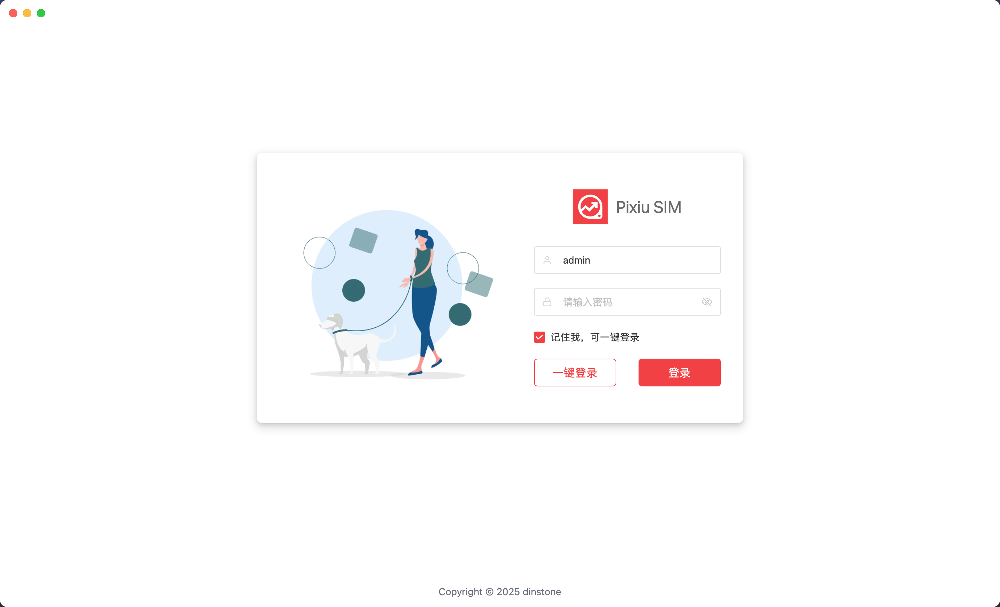
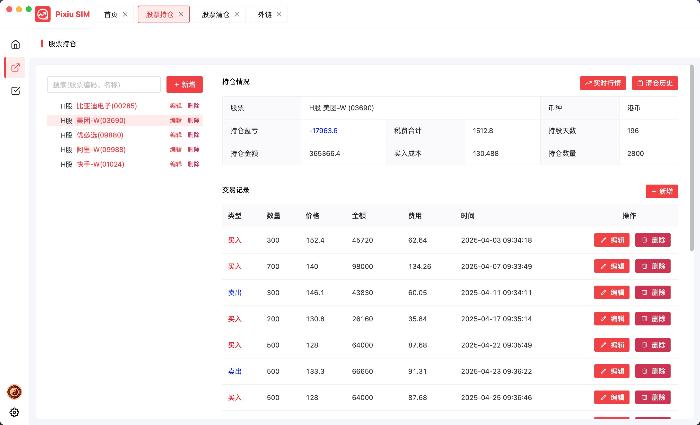
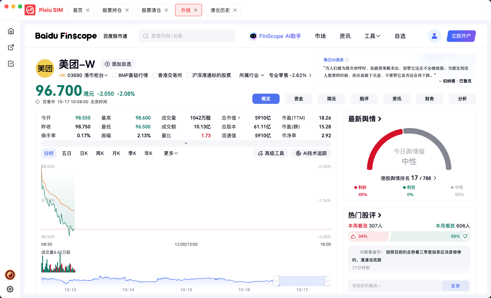
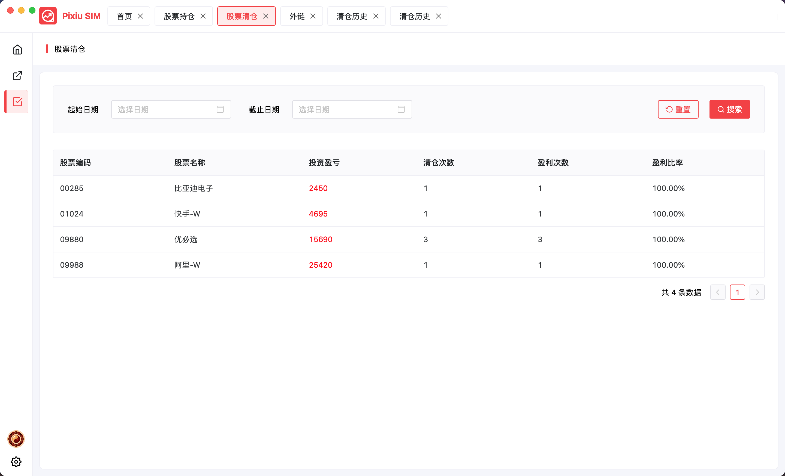
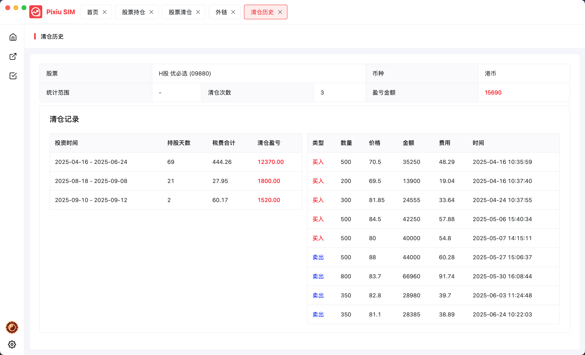

<h1 align="center">Pixiu SIM</h1>

<strong>Pixiu is a modern lightweight cross-platform Stock Investment Management Desktop System.

这是一款极简风格的 股票投资管理 桌面系统，包含前后端解决方案，前端使用 Wails + Vite + Vue3 + NaiveUI + Pinia + Unocss，后端使用 Go + Gorm + Sqlite，简单易用，赏心悦目，历经十几次重构和细节打磨，诚意满满！！</strong>

<picture>

</picture>

## Live Development

To run in live development mode, run `wails dev` in the project directory. This will run a Vite development
server that will provide very fast hot reload of your frontend changes. If you want to develop in a browser
and have access to your Go methods, there is also a dev server that runs on http://localhost:34115. Connect
to this in your browser, and you can call your Go code from devtools.

## Building

To build a redistributable, production mode package, use `wails build`.

## wails 应用图标制作
选择在线制作AppIcon，下载AppIcon.icns文件后，打开文件，抽取其中的一张图标，保存为appicon.png即可。